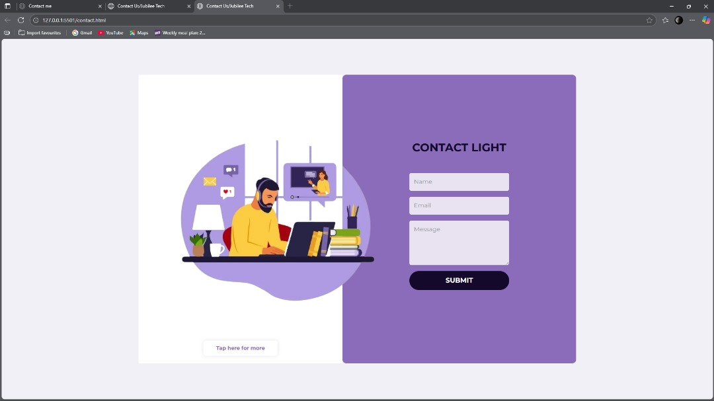

.```
# ContactLight – Modern Responsive Contact Page  

  
  
  
  
  

---

## 📖 Overview  
**ContactLight** is a sleek, fully responsive contact page built with HTML, CSS, and Bootstrap.  
It’s designed to integrate seamlessly with **Google Forms** for backend-free form submission.  

---

## 📸 Screenshot  
  
*(Replace with your actual screenshot path)*

---

## ✨ Features  
- 📱 **Responsive Design** – Works on all screen sizes  
- 🎨 **Clean UI** – Modern and minimal styling  
- 📨 **Google Forms Integration** – No backend required  
- 🖼 **Illustrated Left Panel** – With footer call-to-action  
- ⚡ **Fast Load Time** – Lightweight HTML & CSS

---

## 🛠 Technologies Used  
- **HTML5** – Semantic structure  
- **CSS3** – Custom styling & responsiveness  
- **Bootstrap 5** – Grid system & components  
- **Google Fonts** – Montserrat typography  
- **Google Forms** – Data collection

---

## 📂 Project Structure  
```

.
├── contact.html
├── css
│   └── contact.css
├── img
│   ├── contact.png
│   └── screenshot.png
└── README.md

````


---

## 🚀 Getting Started  

### 1️⃣ Installation  
Clone the repo:  
```bash
git clone https://github.com/Nwigwe-Light/contactlight.git
````

### 2️⃣ Usage

* Open `contact.html` in your browser
* Replace the form `action` URL and `entry.xxxxx` IDs with your Google Form’s details
* Update images if needed

---

## 📧 Google Forms Integration

To link your own form:

1. Create a Google Form
2. Change `/viewform` in the URL to `/formResponse`
3. Copy the `entry.xxxxxxxx` names from the form inputs
4. Replace them in `contact.html`

---

## 👤 Author

**Jubilee Nwigwe**

* GitHub: [Your GitHub Profile](https://github.com/Nwigwe-Light)
* Linktree: [The Latter Glory](https://linktr.ee/thelatterglory)

---

## 📜 License

This project is licensed under the MIT License – see the [LICENSE](LICENSE) file for details.

```
